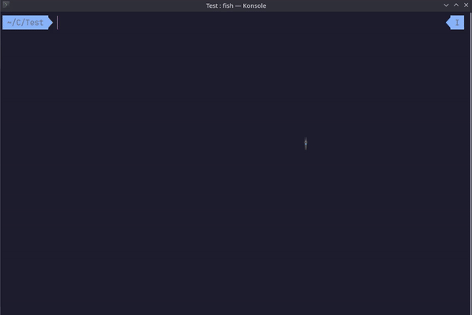

# Focus - A CLI Based Code Editor

Focus is a command-line interface (CLI) based code editor designed for simplicity and efficiency. It offers essential features for text editing, syntax highlighting, Search feature and file management.



## Features

-  **User-Friendly:** Focus provides a clean and intuitive interface suitable for both beginners and experienced users.

-  **Customization:** Personalize your editing experience with customization options.

-  **Cross-Platform Compatibility:** Works seamlessly on various operating systems and terminal emulators.

-  **Syntax Highlighting:** Enhances code readability with a custom syntax highlighting module.

-  **Efficiency:** Designed for a responsive and productive editing experience.


## Getting Started

### Prerequisites

- C compiler

- Standard C libraries


### Building the Project

Use the provided build scripts for your operating system:

 - **For Linux:**

	- **Installation**

		For linux users. first **make sure that you have gcc compiler installed in your system**.
		Then just go to the folder where you have installed **focus** and run **build.sh** file in bash.

		Like this : -

	
		```
		$ ./build.sh
		```
		
		If build is successfully completed then you will be able to run Focus Editor from anywhere by just typing **focus** in bash or terminal.
	
	- **Uninstallation**

		To uninstall Focus Editor do same but just run uninstall.sh file this time.

		Like this : -
		```
		$ ./uninstall.sh
		```
<hr>
		
 - **For Windows:**

	Not working on windows for now, some header files like **<sys/ioctl.h>** and **<termios.h>** are not there in windows.

	Working on it so that it works well on windows too without any extra downloadings.

	_Until then enjoy **focus** on linux!_